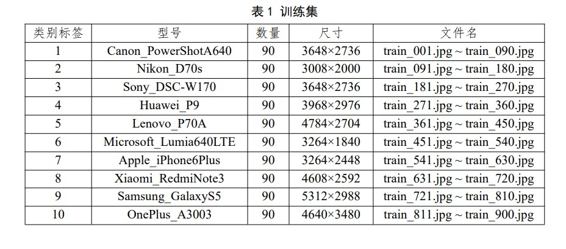

# Camera-Model-Identification
  使用keras框架，用于图像溯源（Using keras,for camear model identification ）
 
 ## 项目目的
 进行图像溯源。训练集为10类相机/手机拍摄的图片，如下所示。  
   
 测试集 II 总共包含 200 幅测试图像，均来自训练集中的 10 种相机/手机，每一类的测试图像数目不定。  
 
 测试集 II 中的 200 幅测试图像，均为原始拍摄的 JPG 图像，从图像中心位置剪切 512×512 的区域后，再经过压缩（质量因子为 85）或者加噪（高斯白噪
声）后的图像，并存储为 PNG 图像。  

 ## 如何使用
 1. preprocess文件夹中包含对数据进行预处理的代码，包括裁剪、压缩、加噪等。
 2. models文件夹中保存有使用的分类模型，其中最终采用的是vgg_256.py,该文件实现了VGG256类，具体算法原理见下一部分。
 3. model_weight文件夹中保存有训练权重，权重名含有训练轮数和验证集准确率。如果你需要进行的分类任务的相机种类和该项目不同，则删除所有权重，或者再该权重基础上进行迁移学习。
 4. datasets文件夹下储存你的训练集、验证集和测试集。
 5. ultis文件夹下储存了一些可能有用的代码，主要用于预处理阶段。
 6. 训练采用vgg256-train.ipynb文件
 7. evaluate.ipnb文件用于评估模型
 8. predict.py文件用于预测
 9. 算法简述.pdf存有对算法的简要叙述
 
 ## 原理与实验
 采用vgg16进行分类，具体的操作见算法简述以及ipynb文件。     
 该程序在验证集中取得了98%的准确率。

> 备注：
> 如需参考请附上链接：https://github.com/cai525/Camera-Model-Identification

> 见鬼，现在看代码太乱了，如果真有打算参考的，嗯...努力重构吧（2023-03-16）
